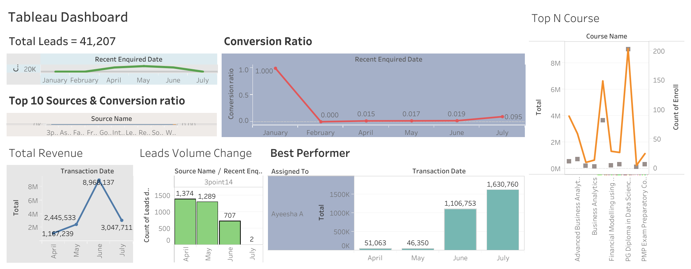

# Tableau

# Covid Data Analysis & Visualization

- Visualization of covid dataset like top 5 affected states, death ratio and ratio of death vs confirmed cases.

# Revenue & Leads Data Visualization

- The dashboard represents the employee performance and attrition rate.

